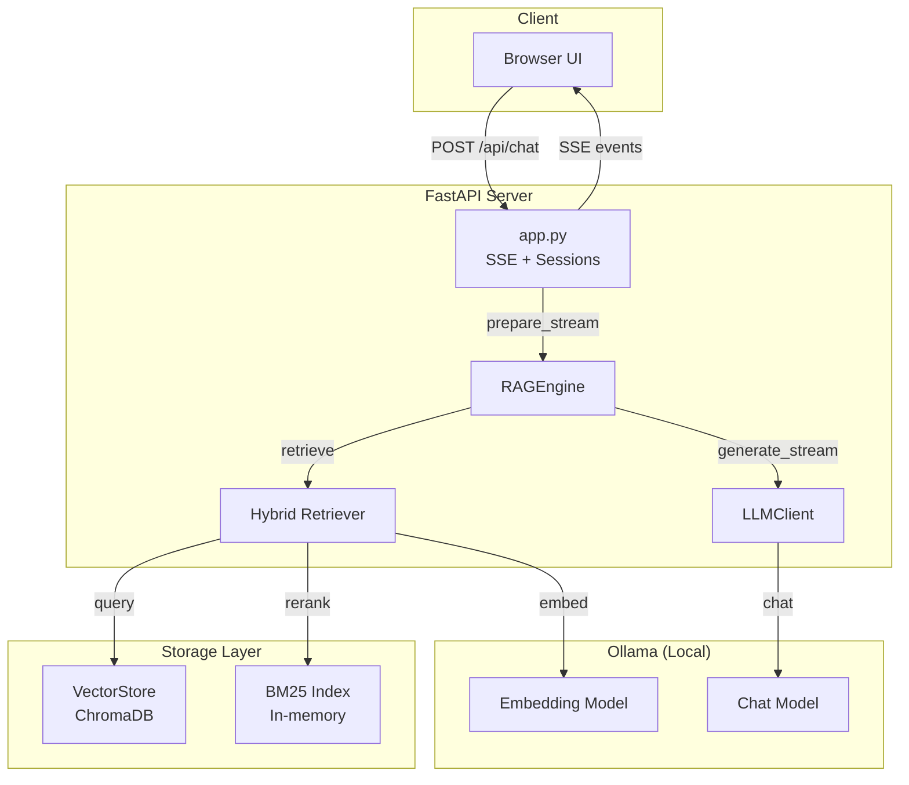

# Helpdesk RAG

Local RAG chatbot for IT support documentation. Drops documents into a folder, ingests them into ChromaDB, and serves a browser-based chat interface with streaming responses — all powered by Ollama running on your machine.


## Features

- **Local-first** — data never leaves your machine; Ollama handles both embeddings and generation
- **Hybrid retrieval** — combines vector similarity (ChromaDB) with keyword search (BM25), or use either method alone
- **Real-time streaming** — SSE delivers tokens as they're generated, with Markdown rendering
- **Multi-format documents** — PDF, DOCX, Markdown, and plain text
- **Conversation history** — per-session context carried across turns (configurable depth)
- **Configurable** — YAML config file with environment variable overrides

## Architecture

The system follows a modular RAG (Retrieval-Augmented Generation) architecture where each component has a single responsibility.

### System Overview



**Request Flow:**
1. Browser sends chat message to FastAPI endpoint
2. `RAGEngine` orchestrates retrieval and generation
3. `Hybrid Retriever` finds relevant document chunks
4. `LLMClient` streams response tokens from Ollama
5. Server-sent events deliver tokens to browser in real-time

### Hybrid Retrieval Pipeline

The system uses a two-stage retrieval with weighted re-ranking:

```
Query ──► Embedding ──► Vector Search ──► 2× candidates
                                                   │
                      ┌────────────────────────────┘
                      ▼
              Filter by min_score
                      │
          ┌───────────┴───────────┐
          ▼                       ▼
   Vector Score (60%)      BM25 Score (40%)
          └───────────┬───────────┘
                      ▼
              Weighted Fusion
                      │
                      ▼
                Top-K Results
```

| Stage | Description |
|-------|-------------|
| **Candidate Generation** | Vector similarity retrieves `top_k × 2` chunks |
| **Filtering** | Chunks below `min_score` threshold discarded |
| **Re-ranking** | Combined score = 0.6×vector + 0.4×BM25 |

The BM25 index is built lazily on first hybrid query and cached with thread-safe locking.

### Server-Sent Events Streaming

Real-time responses delivered via SSE with four event types:

| Event | When | Data |
|-------|------|------|
| `sources` | After retrieval | JSON array of source documents |
| `token` | Per-LLM-token | JSON string (the token) |
| `error` | On failure | JSON string (error message) |
| `done` | Stream complete | Empty |

**Two-Phase Commit:** User messages are only saved to history after successful retrieval, preventing corrupted conversation state.

### Session Management

Stateful conversations with automatic cleanup:

| Setting | Value | Purpose |
|---------|-------|---------|
| `SESSION_MAX_AGE` | 3600s | Session timeout (1 hour) |
| `MAX_SESSIONS` | 1000 | Memory cap with LRU eviction |

Background cleanup runs every 10 minutes to remove expired sessions.

### Design Decisions

| Decision | Rationale |
|----------|-----------|
| **OpenAI-compatible API** | Model portability — swap Ollama for OpenAI, vLLM, etc. |
| **Lazy BM25 indexing** | Avoid startup delay; build only when needed |
| **Two-phase message commit** | Prevent corrupted history on retrieval failure |
| **Sentence-boundary truncation** | Preserve readability when context exceeds limit |
| **Incremental ingestion** | Skip existing chunks; support document updates |
| **Thread-safe BM25 cache** | Prevent race conditions during concurrent queries |

## Quick Start

### Prerequisites

- [Ollama](https://ollama.com) installed and running
- Python 3.11, 3.12, or 3.13
- [uv](https://docs.astral.sh/uv/) package manager

### The easy way: interactive menu

For non-technical users, run the interactive launcher and follow the numbered menu:

```bash
git clone https://github.com/ThuoBrian/Local-RAG-chatbot-for-Technology-Support.git
cd Local-RAG-chatbot-for-Technology-Support
./scripts/helpdesk.sh
```

The menu will guide you through setup, Ollama checks, adding documents, ingestion, and starting the chat server.

### The command-line way

#### 1. Pull Ollama models

```bash
ollama pull nomic-embed-text   # embedding model
ollama pull glm-5.1:cloud      # chat model
```

#### 2. Set up the project

```bash
uv venv --python 3.13
uv pip install -e .
```

Or use the setup script, which also copies example config and `.env` files:

```bash
./scripts/setup.sh
```

#### 3. Add your documents

Place PDF, DOCX, Markdown, or TXT files in `data/documents/`:

```bash
cp /path/to/your/documents/*.pdf data/documents/
```

#### 4. Ingest documents

```bash
./scripts/ingest.sh
```

This chunks your documents, generates embeddings via Ollama, and stores them in ChromaDB. Progress bars show per-file and per-batch status. Re-running ingestion skips duplicates automatically.

#### 5. Start the server

Use the startup script (auto-ingests if the vector store is empty):

```bash
./scripts/start.sh
```

Or run manually:

```bash
.venv/bin/uvicorn helpdesk_rag.app:app --host 127.0.0.1 --port 8000
```

Open **http://localhost:8000** in your browser.

## Configuration

All settings live in `config/config.yaml`. You can also override any value with environment variables — env vars take precedence.

### config/config.yaml

```yaml
ollama:
  base_url: "http://localhost:11434/v1"  # Ollama OpenAI-compatible endpoint
  embedding_model: "nomic-embed-text"     # model for embeddings
  llm_model: "glm-5.1:cloud"             # model for chat generation
  temperature: 0.3                        # 0.0–2.0
  max_tokens: 768                         # max tokens per response

chunking:
  chunk_size: 1000                        # max characters per chunk
  chunk_overlap: 200                      # overlap characters between chunks

vector_store:
  persist_dir: "data/chroma"              # ChromaDB storage directory
  collection_name: "helpdesk_docs"        # collection name in ChromaDB

retrieval:
  top_k: 4                                # number of chunks to retrieve
  method: "hybrid"                        # "vector", "bm25", or "hybrid"
  min_score: 0.3                          # minimum relevance score (0.0–1.0)

chat:
  max_history_turns: 4                    # conversation turns included in prompt
  max_context_chars: 6000                 # max characters of context in prompt
```

### Environment variable overrides

| Env var | Config key | Type | Default |
|---|---|---|---|
| `OLLAMA_BASE_URL` | `ollama.base_url` | str | `http://localhost:11434/v1` |
| `OLLAMA_EMBEDDING_MODEL` | `ollama.embedding_model` | str | `nomic-embed-text` |
| `OLLAMA_LLM_MODEL` | `ollama.llm_model` | str | `glm-5.1:cloud` |
| `OLLAMA_TEMPERATURE` | `ollama.temperature` | float | `0.3` |
| `OLLAMA_MAX_TOKENS` | `ollama.max_tokens` | int | `768` |
| `CHUNK_SIZE` | `chunking.chunk_size` | int | `1000` |
| `CHUNK_OVERLAP` | `chunking.chunk_overlap` | int | `200` |
| `RETRIEVAL_TOP_K` | `retrieval.top_k` | int | `4` |
| `RETRIEVAL_MIN_SCORE` | `retrieval.min_score` | float | `0.3` |
| `MAX_CONTEXT_CHARS` | `chat.max_context_chars` | int | `6000` |
| `MAX_HISTORY_TURNS` | `chat.max_history_turns` | int | `4` |
| `HOST` | server host (uvicorn) | str | `127.0.0.1` |
| `PORT` | server port (uvicorn) | int | `8000` |

## Adding Documents

Drop files into `data/documents/` and re-run ingestion:

```bash
./scripts/ingest.sh
```

Supported formats: **PDF**, **DOCX**, **Markdown** (`.md`), **plain text** (`.txt`).

Ingestion skips chunks that already exist in the vector store, so you can run it repeatedly without duplicating data.

## Docker

Build and run with Docker Compose:

```bash
docker compose -f docker/docker-compose.yml up --build
```

Or build and run manually:

```bash
docker build -t helpdesk-rag -f docker/Dockerfile .
docker run -p 8000:8000 --env-file .env -v $(pwd)/config/config.yaml:/app/config/config.yaml helpdesk-rag
```

The container runs `scripts/docker-entrypoint.sh`, which auto-ingests documents if the vector store is empty.

## Project Structure

```
helpdesk_rag/              # Python source code
  app.py                   # FastAPI app with SSE streaming and session management
  config.py                # Pydantic config models with env-var overrides
  engine.py                # RAG orchestration (retrieval + LLM generation)
  retriever.py             # Hybrid / vector / BM25 retrieval with weighted re-ranking
  vector_store.py          # ChromaDB wrapper (add, query, count, get_sources)
  embeddings.py            # OpenAI-compatible embedding client for Ollama
  llm_client.py            # OpenAI-compatible LLM client (generate + stream)
  loader.py                # Multi-format document loader (PDF, DOCX, MD, TXT)
  chunker.py               # Recursive text chunker with configurable overlap
  ingest.py                # Document ingestion CLI with progress bars
  exceptions.py            # Custom exception hierarchy
  logging_config.py        # Centralized logging setup
frontend/                  # UI assets
  templates/
    index.html             # Single-page chat UI (Jinja2 template)
  static/
    css/style.css          # UI stylesheet
    js/app.js              # SSE client, Markdown rendering, session management
config/                    # Configuration files
  config.yaml              # Active configuration
  config.example.yaml      # Example configuration for new setups
  config.docker.yaml       # Docker-specific configuration
data/                      # Runtime data (contents gitignored)
  documents/               # Drop your documents here
  chroma/                  # Persisted vector store (auto-generated)
docs/                      # Additional documentation
  CODE_REVIEW.md
scripts/                   # Automation scripts
  helpdesk.sh              # Interactive menu for non-IT users
  setup.sh                 # One-command development setup
  start.sh                 # Start the chat server
  ingest.sh                # Ingest documents
  docker-entrypoint.sh     # Docker container entrypoint
docker/                    # Docker assets
  Dockerfile
  docker-compose.yml
  .dockerignore
tests/                     # Test suite
  fixtures/                # Shared test documents
  test_*.py
```

## Development

```bash
uv pip install -e ".[dev]"   # install with dev dependencies
make test                    # run unit tests (excludes integration)
make test-all                # run all tests including integration
make lint                    # ruff linter check
make typecheck               # mypy strict type checking
make run                     # dev server with auto-reload
```

### Makefile targets

| Target | Command |
|---|---|
| `make setup` | Create venv with uv, install dev deps, copy example config |
| `make install` | `uv pip install -e .` |
| `make dev` | `uv pip install -e ".[dev]"` |
| `make lock` | Regenerate `requirements.lock` and `requirements-dev.lock` |
| `make test` | `.venv/bin/pytest -m "not integration"` |
| `make test-all` | `.venv/bin/pytest` |
| `make lint` | `.venv/bin/ruff check helpdesk_rag/` |
| `make typecheck` | `.venv/bin/mypy helpdesk_rag/` |
| `make clean` | Remove build artifacts |
| `make run` | `.venv/bin/uvicorn helpdesk_rag.app:app --reload --host 127.0.0.1` |
| `make ingest` | `./scripts/ingest.sh` |

## API Reference

### `GET /`

Serves the chat UI (HTML page).

### `POST /api/chat`

Accepts a chat message and returns a streaming SSE response.

**Request body:**

```json
{
  "message": "How do I enable BitLocker?",
  "session_id": "uuid-string"
}
```

**SSE event types:**

| Event | Data | Description |
|---|---|---|
| `sources` | JSON array of source objects | Retrieved document chunks with metadata |
| `token` | JSON string | Individual generated token |
| `error` | JSON string | Error message |
| `done` | (empty) | Stream completed |

## License

[MIT](LICENSE)